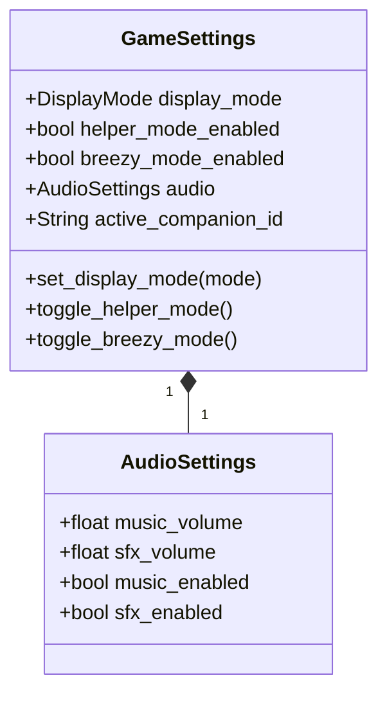

# Polish Wrapper Domain Model

> **Vision Alignment**: The presentation layer that makes everything feel "premium" and "juicy". Cute anime cat girl companion, relaxing Kirby-style music, confetti explosions, and toggleable Zen mode for purists.

---

## Bounded Context: User Experience

### Aggregate: GameSettings

Manages player preferences and experience toggles.

### Value Objects

| Name | Properties | Purpose |
|------|------------|---------|
| `DisplayMode` | `NORMAL`, `ZEN` | Normal (gems, anime) vs Zen (pencil/paper aesthetic) |
| `AudioSettings` | `music_volume`, `sfx_volume`, `enabled` | Audio preferences |
| `CompanionDialogue` | `trigger`, `lines[]`, `emotion` | What the cat girl says |

### Domain Events

| Event | Payload | Trigger |
|-------|---------|---------|
| `SettingsChanged` | `setting_key`, `new_value` | Player changes a setting |
| `CompanionSpoke` | `dialogue`, `emotion` | Cat girl delivers a line |
| `CelebrationTriggered` | `celebration_type` | Confetti, fireworks, etc. |

### Domain Services

| Service | Responsibility |
|---------|----------------|
| `CompanionDialogueService` | Selects appropriate dialogue based on game events |
| `CelebrationService` | Triggers visual effects (confetti, screen shake, etc.) |

### Repositories

| Repository | Responsibility |
|------------|----------------|
| `SettingsRepository` | Save/load user preferences |

---

## Companion Dialogue System

The Cat Girl companion reacts to game events with encouraging, kid-friendly dialogue:

| Event | Example Dialogue | Emotion |
|-------|------------------|---------|
| `NumberPlaced` (correct) | "Great job! You're so smart!" | Happy |
| `MistakeMade` | "Oops! That's okay, try again!" | Encouraging |
| `PuzzleSolved` | "WOW! You did it! Amazing!" | Excited |
| `HintUsed` | "Here's a little help, friend!" | Helpful |
| `PetEvolved` | "Look at your pet! So cool!" | Amazed |
| `IdleFor30Seconds` | "I believe in you! Take your time~" | Patient |

---

## Display Modes

### Normal Mode (Default)
- Colorful gem visuals for numbers
- Anime-styled UI panels
- Cat girl companion visible
- Particle effects and animations
- Upbeat Kirby-style music

### Zen Mode
- Clean pencil-on-paper aesthetic
- Minimal UI, no companion
- Traditional number display
- Soft ambient music or silence
- For adults who want pure Sudoku

---

## Breezy Mode (Helper Toggle)

When enabled:
- Auto-fills "naked singles" (cells with only one candidate)
- Highlights cells where only one number is possible
- Auto-populates pencil marks based on constraints
- Perfect for grinding Gold/XP or learning techniques

---

## Integration Points

- **Inbound Event**: `PuzzleSolved`, `MistakeMade`, `PetEvolved` → Triggers companion dialogue.
- **Inbound Event**: `LevelCompleted` → Triggers celebration effects.
- **Outbound**: None (presentation layer, only consumes events).
