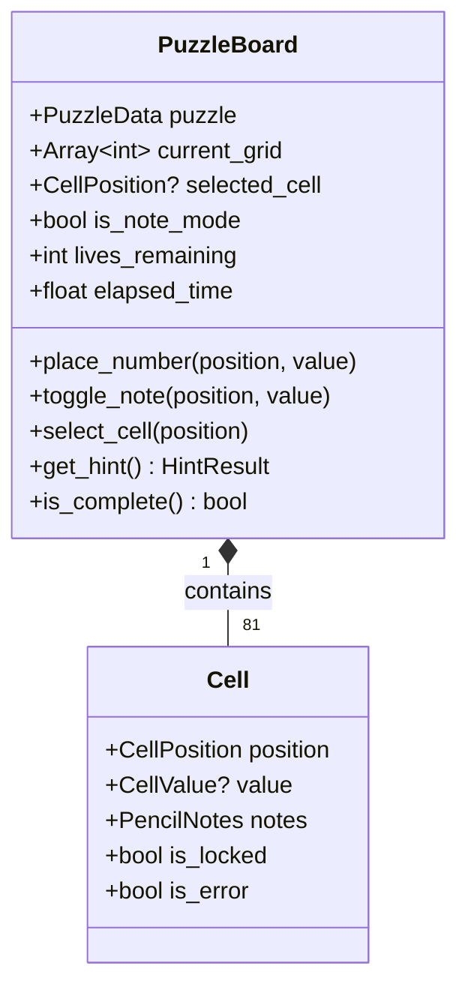

# Core Sudoku Domain Model

> **Vision Alignment**: This is the heart of the game—the actual puzzle-solving experience. It must be intuitive, visually delightful (gems, not numbers), and educational (explains *why* you're wrong).

---

## Bounded Context: Puzzle Solving

### Aggregate: PuzzleBoard

The central aggregate managing the state of an active Sudoku puzzle.

### Value Objects

| Name | Properties | Purpose |
|------|------------|---------|
| `CellPosition` | `row: int`, `col: int` | Immutable grid coordinate (0-8) |
| `CellValue` | `value: int` (1-9) | A valid Sudoku number, maps to a Gem type |
| `PencilNotes` | `candidates: Array[int]` | Set of possible values for a cell |
| `GridSize` | `SIZE_4X4`, `SIZE_6X6`, `SIZE_9X9` | Enum for board dimensions |
| `HintResult` | `position: CellPosition`, `value: int`, `reason: String` | Hint explanation for the player |

### Domain Events

| Event | Payload | Trigger |
|-------|---------|---------|
| `NumberPlaced` | `position`, `value`, `is_correct` | Player places a final number |
| `MistakeMade` | `position`, `value`, `conflict_reason` | Player places an incorrect number |
| `PuzzleSolved` | `time_taken`, `mistakes_made` | All cells filled correctly |
| `HintRequested` | `position`, `hint_type` | Player asks for help |
| `CellSelected` | `position` | Player taps a cell |

### Domain Services

| Service | Responsibility |
|---------|----------------|
| `SudokuValidator` | Checks row/column/box constraints, returns conflict explanations |
| `SudokuGenerator` | Creates valid puzzles of varying difficulty |
| `HintEngine` | Analyzes board state and suggests logical next moves |

### Policies

| Policy | Rule |
|--------|------|
| `ErrorFeedbackPolicy` | When a mistake is made, emit `MistakeMade` with kid-friendly explanation ("Oops! There's already a Blue Gem in this row!") |
| `LivesPolicy` | Player loses 1 life on mistake; at 0 lives, puzzle fails (but can retry!) |

---

## Integration Points

- **Outbound Event**: `PuzzleSolved` → Consumed by Meta Progression to award XP/Gold.
- **Outbound Event**: `NumberPlaced` → Consumed by Meta Progression for per-number XP.
- **Inbound**: Receives `PuzzleData` from `LevelRepository`.
