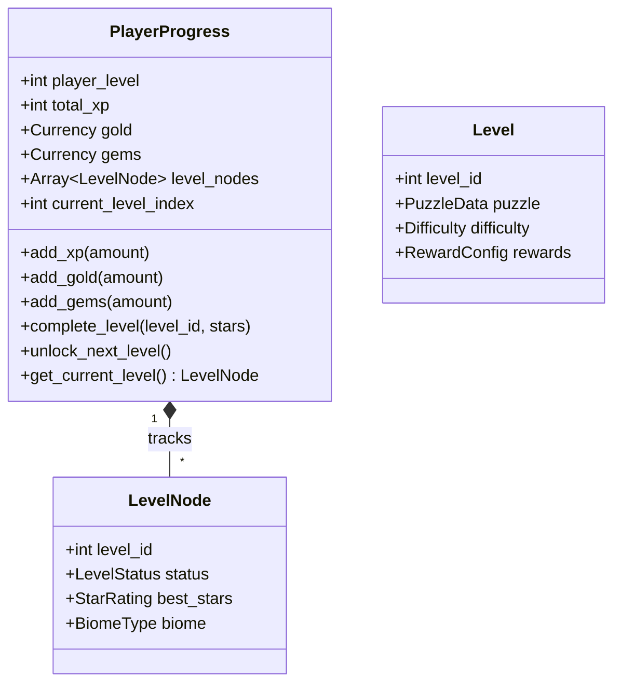

# Meta Progression Domain Model

> **Vision Alignment**: The "Candy Crush" addictive loop—completing puzzles earns Gold, XP, and Gems. Levels unlock sequentially on a colorful world map. Every action feels rewarding!

---

## Bounded Context: Player Journey

### Aggregate: PlayerProgress

Tracks the player's overall journey through the game.



### Value Objects

| Name | Properties | Purpose |
|------|------------|---------|
| `Currency` | `type: CurrencyType`, `amount: int` | Gold (gacha), XP (leveling), Gems (premium) |
| `CurrencyType` | `GOLD`, `XP`, `GEMS` | Enum for currency types |
| `StarRating` | `stars: int` (0-3) | Level completion quality |
| `BiomeType` | `JUNGLE`, `DESERT`, `OCEAN`, `MOUNTAIN` | World map visual theme |
| `LevelStatus` | `LOCKED`, `UNLOCKED`, `COMPLETED` | Level progression state |
| `RewardConfig` | `base_gold`, `base_xp`, `star_bonuses` | Per-level reward configuration |

### Domain Events

| Event | Payload | Trigger |
|-------|---------|---------|
| `LevelCompleted` | `level_id`, `stars`, `time`, `mistakes` | Player finishes a puzzle |
| `CurrencyEarned` | `currency_type`, `amount`, `source` | Any currency gain |
| `PlayerLeveledUp` | `new_level`, `xp_to_next` | XP threshold crossed |
| `LevelUnlocked` | `level_id`, `biome` | New level becomes available |

### Domain Services

| Service | Responsibility |
|---------|----------------|
| `RewardCalculator` | Computes XP, Gold, Gems based on performance (time, mistakes, difficulty) |

### Repositories

| Repository | Responsibility |
|------------|----------------|
| `PlayerProgressRepository` | Save/load player progress to local storage |
| `LevelRepository` | Load level definitions (puzzles, rewards) |

---

## Reward Formula (Kid-Friendly)

```
Base XP per correct number: 10
Base Gold per level: 
  - Easy: 50
  - Medium: 100
  - Hard: 200

Star Bonuses:
  - 0 mistakes: +50% Gold, +1 Star
  - Under 2 minutes: +25% Gold, +1 Star
  - No hints used: +1 Star

XP to Level Up: current_level * 100
```

---

## Integration Points

- **Inbound Event**: `PuzzleSolved` → Triggers `RewardCalculator`, emits `CurrencyEarned`.
- **Inbound Event**: `NumberPlaced` (is_correct=true) → Award 10 XP immediately.
- **Outbound**: `CurrencyEarned` → Pet System listens for gacha currency updates.
