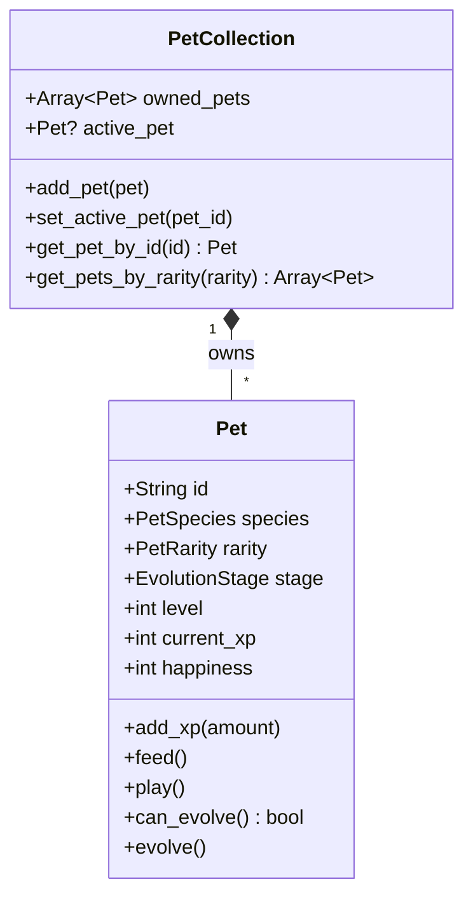

# Pet System Domain Model

> **Vision Alignment**: The "Tamagotchi meets Pokemon" layer. Collect cute pets from gacha capsules using earned Gold. Pets level up and evolve as you solve puzzles. They're persistent, never die, and are always happy to see you!

---

## Bounded Context: Pet Collection

### Aggregate: PetCollection

Manages all pets the player owns.

### Value Objects

| Name | Properties | Purpose |
|------|------------|---------|
| `PetSpecies` | `name`, `base_sprite`, `evolved_sprites`, `dialogue_lines` | Species definition (Cat, Owl, Goblin, etc.) |
| `PetRarity` | `COMMON`, `UNCOMMON`, `RARE`, `EPIC`, `LEGENDARY` | Pull rates and visual flair |
| `EvolutionStage` | `BABY`, `TEEN`, `ADULT`, `MYTHIC` | Visual/stat progression |
| `GachaCost` | `currency_type`, `amount` | Cost to pull (always earned currency, never real money!) |

### Domain Events

| Event | Payload | Trigger |
|-------|---------|---------|
| `PetAcquired` | `pet`, `source` (gacha/reward) | New pet added to collection |
| `PetLeveledUp` | `pet_id`, `new_level` | Pet gains enough XP |
| `PetEvolved` | `pet_id`, `new_stage` | Pet evolves to next form |
| `GachaPulled` | `cost`, `result_pet` | Player uses gacha machine |
| `PetInteraction` | `pet_id`, `interaction_type` | Player feeds or plays with pet |

### Domain Services

| Service | Responsibility |
|---------|----------------|
| `GachaMachine` | Handles random pet selection based on rarity tables (fair, kid-friendly rates) |
| `PetInteractionService` | Processes feeding/playing, increases happiness |

### Policies

| Policy | Rule |
|--------|------|
| `EvolutionPolicy` | Pet evolves at Level 10 (Baby→Teen), Level 25 (Teen→Adult), Level 50 (Adult→Mythic) |
| `GachaRatePolicy` | Common: 50%, Uncommon: 30%, Rare: 15%, Epic: 4%, Legendary: 1% |
| `DuplicatePolicy` | If pet already owned, gain bonus XP for that pet instead |
| `HappinessPolicy` | Happiness affects dialogue tone; never drops below 50 (they're always happy-ish!) |

### Repositories

| Repository | Responsibility |
|------------|----------------|
| `PetCollectionRepository` | Save/load owned pets |
| `PetSpeciesRepository` | Load species definitions |

---

## Gacha Philosophy (Kid-Friendly, Ethical)

- **NO real money purchases** for gacha.
- All pulls use **earned Gold** from solving puzzles.
- Duplicate pets give **bonus XP** to existing pet (no "waste" feeling).
- Pity system: After 10 pulls without Rare+, guaranteed Rare.
- All pets are adorable; no "trash tier" vibes.

---

## Pet Species Examples

| Species | Rarity | Personality |
|---------|--------|-------------|
| Whisker Cat | Common | Playful, loves naps |
| Hoot Owl | Common | Wise, gives study tips |
| Gobbo | Uncommon | Mischievous, loves gold |
| Sparkle Fox | Rare | Magical, cheers loudly |
| Fluffdragon | Epic | Tiny dragon, very proud |
| Starlight Kirin | Legendary | Celestial, speaks in riddles |

---

## Integration Points

- **Inbound Event**: `CurrencyEarned` → Updates available Gold for gacha.
- **Inbound Event**: `NumberPlaced` (is_correct=true) → Active pet gains XP.
- **Outbound Event**: `PetEvolved` → Could trigger celebratory UI (confetti!).
