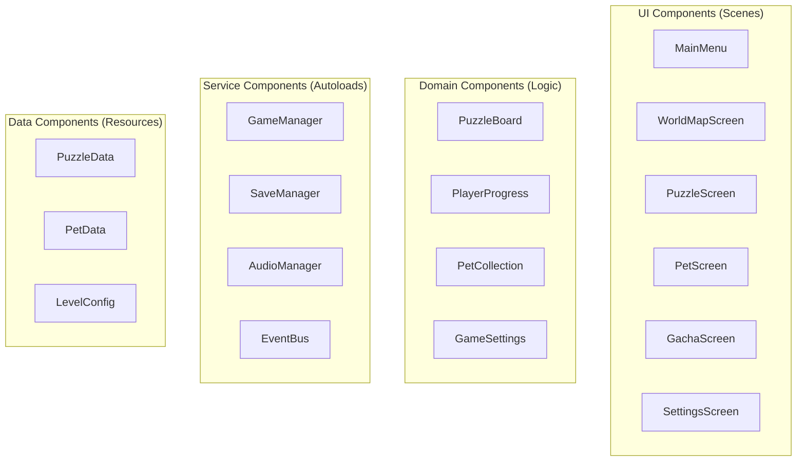
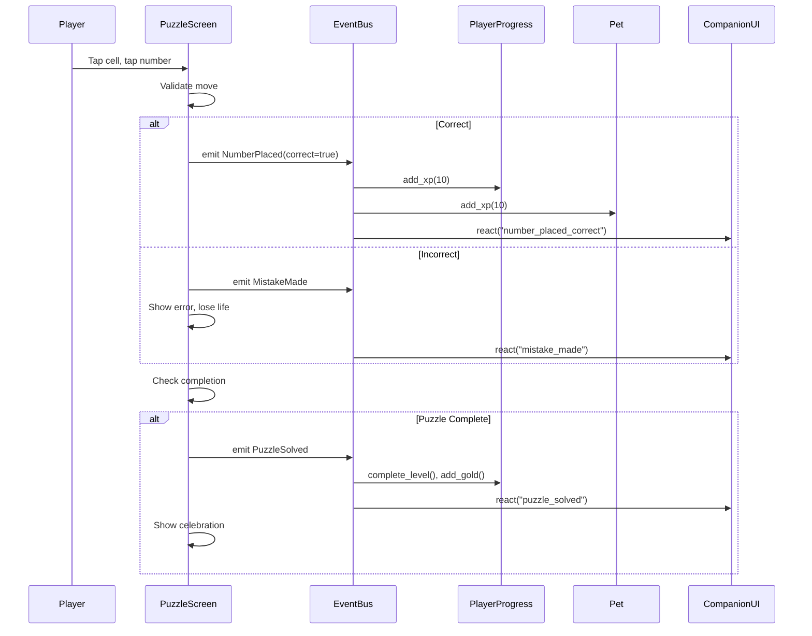
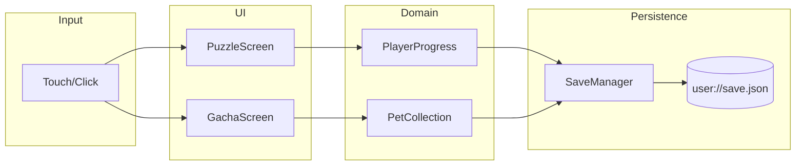

# Sudoku Pets: Component Model

> A comprehensive design document defining all components, their attributes, behaviors, and interactions for implementing the Sudoku Pets user stories.

---

## 1. Component Categories

---

## 2. UI Components

### 2.1 MainMenu
**Purpose**: Entry point, navigation hub.

| Attribute | Type | Description |
|-----------|------|-------------|
| `companion_sprite` | Sprite2D | Cat girl companion visual |
| `player_stats_label` | Label | Shows level, gold, gems |

| Behavior | Description |
|----------|-------------|
| `_on_play_pressed()` | Navigate to WorldMap |
| `_on_pets_pressed()` | Navigate to PetScreen |
| `_on_settings_pressed()` | Open SettingsScreen |

**Stories**: 5.1 (Anime Aesthetic)

---

### 2.2 WorldMapScreen
**Purpose**: Level selection with scrollable path.

| Attribute | Type | Description |
|-----------|------|-------------|
| `level_nodes` | Array[LevelNode] | All level buttons on path |
| `current_biome` | BiomeType | Visual theme (Jungle, Desert) |
| `scroll_position` | float | Camera scroll offset |

| Behavior | Description |
|----------|-------------|
| `_load_level_states()` | Load stars/unlock status from PlayerProgress |
| `_on_level_selected(id)` | Open level detail popup |
| `_scroll_to_level(id)` | Smoothly scroll to a level |

**Stories**: 3.1 (World Map), 3.2 (Replayability)

---

### 2.3 PuzzleScreen
**Purpose**: Core gameplay—the Sudoku grid and input.

| Attribute | Type | Description |
|-----------|------|-------------|
| `grid` | GridContainer | 9x9 (or 6x6, 4x4) cell grid |
| `cells` | Array[CellButton] | Individual cell buttons |
| `number_pad` | NumberPad | Input buttons 1-9 |
| `selected_cell` | Vector2i | Currently selected cell |
| `is_note_mode` | bool | Pencil notes toggle |
| `lives` | int | Remaining lives (default 3) |
| `timer` | float | Elapsed time |

| Behavior | Description |
|----------|-------------|
| `_on_cell_pressed(pos)` | Select cell, highlight related cells |
| `_on_number_pressed(num)` | Place number or toggle note |
| `_validate_move(pos, num)` | Check against solution, emit events |
| `_show_error_feedback(pos, reason)` | Highlight conflict, show explanation |
| `_check_completion()` | Emit PuzzleSolved if all correct |
| `_request_hint()` | Use HintEngine, highlight suggestion |

**Stories**: 1.1 (Visual Numbers), 1.2 (Grid Scaling), 1.3 (Input Feedback), 1.5 (Pencil Notes), 2.1 (Educated Error), 2.2 (Hint System)

---

### 2.4 CellButton
**Purpose**: Individual grid cell.

| Attribute | Type | Description |
|-----------|------|-------------|
| `position` | Vector2i | Grid coordinates |
| `value` | int | Current number (0=empty) |
| `is_locked` | bool | Given number, not editable |
| `notes` | Array[int] | Pencil mark candidates |
| `is_error` | bool | Currently showing error state |
| `gem_color` | Color | Color based on value |

| Behavior | Description |
|----------|-------------|
| `set_value(num)` | Update display, animate gem |
| `toggle_note(num)` | Add/remove pencil mark |
| `show_error()` | Flash red, shake animation |
| `show_highlight()` | White border for selection |

**Stories**: 1.1 (Visual Numbers), 1.3 (Input Feedback)

---

### 2.5 NumberPad
**Purpose**: Input buttons for placing numbers.

| Attribute | Type | Description |
|-----------|------|-------------|
| `buttons` | Array[Button] | Buttons 1-9 |
| `remaining_counts` | Array[int] | How many of each number left |
| `note_toggle` | Button | Pencil mode toggle |
| `undo_button` | Button | Undo last action |

| Behavior | Description |
|----------|-------------|
| `update_counts(grid)` | Refresh superscript counts |
| `_on_number_pressed(num)` | Emit signal with number |
| `_on_note_toggled()` | Switch input mode |

**Stories**: 1.5 (Pencil Notes)

---

### 2.6 CompanionUI
**Purpose**: Cat girl companion overlay with dialogue.

| Attribute | Type | Description |
|-----------|------|-------------|
| `sprite` | AnimatedSprite2D | Companion animation |
| `dialogue_label` | Label | Speech bubble text |
| `current_emotion` | String | happy, encouraging, excited |

| Behavior | Description |
|----------|-------------|
| `show_dialogue(text, emotion)` | Display text, play animation |
| `react_to_event(event)` | Use CompanionDialogueService |
| `hide()` | Fade out when not speaking |

**Stories**: 2.4 (Encouragement)

---

### 2.7 PetScreen
**Purpose**: Pet collection gallery and interaction.

| Attribute | Type | Description |
|-----------|------|-------------|
| `pet_grid` | GridContainer | Display all owned pets |
| `selected_pet` | Pet | Currently viewed pet |
| `interaction_panel` | Panel | Feed/Play buttons |

| Behavior | Description |
|----------|-------------|
| `_load_collection()` | Get pets from PetCollection |
| `_on_pet_selected(pet)` | Show detail view |
| `_on_feed_pressed()` | Call Pet.feed(), animate |
| `_on_play_pressed()` | Call Pet.play(), animate |
| `_on_set_active_pressed()` | Set as companion |

**Stories**: 4.2 (Pet Collection), 4.4 (Pet Interaction)

---

### 2.8 GachaScreen
**Purpose**: Gacha machine for pulling new pets.

| Attribute | Type | Description |
|-----------|------|-------------|
| `machine_sprite` | Sprite2D | Gacha machine visual |
| `pull_button` | Button | "Pull!" button |
| `gold_label` | Label | Current gold display |
| `pity_progress` | ProgressBar | Pity counter visualization |
| `result_panel` | Panel | Shows acquired pet |

| Behavior | Description |
|----------|-------------|
| `_on_pull_pressed()` | Call GachaMachine.pull() |
| `_show_pull_animation()` | Capsule drop animation |
| `_show_result(pet)` | Reveal new pet with fanfare |
| `_show_duplicate_bonus(xp)` | Show XP bonus for duplicate |

**Stories**: 4.1 (Gacha Machine)

---

### 2.9 SettingsScreen
**Purpose**: User preferences.

| Attribute | Type | Description |
|-----------|------|-------------|
| `display_mode_toggle` | OptionButton | Normal/Zen |
| `helper_mode_toggle` | CheckButton | Enable hints |
| `breezy_mode_toggle` | CheckButton | Auto-fill trivial |
| `music_slider` | Slider | Music volume |
| `sfx_slider` | Slider | SFX volume |

| Behavior | Description |
|----------|-------------|
| `_load_settings()` | Populate from GameSettings |
| `_on_setting_changed()` | Update GameSettings, save |

**Stories**: 1.4 (Zen Mode), 2.3 (Breezy Mode), 5.3 (Audio)

---

## 3. Domain Components

### 3.1 PuzzleBoard (Aggregate)
**Purpose**: Manages active puzzle state.

| Attribute | Type | Description |
|-----------|------|-------------|
| `puzzle` | PuzzleData | Current puzzle definition |
| `current_grid` | Array[int] | Player's current state |
| `notes` | Dictionary | Cell → Array of candidates |
| `moves_history` | Array | For undo functionality |

| Behavior | Description |
|----------|-------------|
| `place_number(pos, num)` | Validate and place |
| `toggle_note(pos, num)` | Add/remove note |
| `undo()` | Revert last move |
| `is_complete()` | Check win condition |

---

### 3.2 PlayerProgress (Aggregate)
**Purpose**: Tracks player journey.

| Attribute | Type | Description |
|-----------|------|-------------|
| `player_level` | int | Current level |
| `current_xp` | int | XP toward next level |
| `gold` | int | Gacha currency |
| `gems` | int | Premium currency |
| `level_stars` | Dictionary | Level ID → best stars |
| `highest_unlocked` | int | Furthest unlocked level |

| Behavior | Description |
|----------|-------------|
| `add_xp(amount)` | Level up if threshold crossed |
| `add_gold(amount)` | Increase gold |
| `complete_level(id, stars)` | Record completion |

**Stories**: 3.3 (Star Rating), 3.4 (XP & Gold)

---

### 3.3 PetCollection (Aggregate)
**Purpose**: Manages owned pets.

| Attribute | Type | Description |
|-----------|------|-------------|
| `pets` | Array[Pet] | All owned pets |
| `active_pet_id` | String | Companion pet |

| Behavior | Description |
|----------|-------------|
| `add_pet(pet)` | Add to collection |
| `get_active_pet()` | Return companion |
| `has_species(id)` | Check for duplicates |

**Stories**: 4.2 (Pet Collection), 4.3 (Pet Leveling)

---

### 3.4 Pet (Entity)
**Purpose**: Individual pet instance.

| Attribute | Type | Description |
|-----------|------|-------------|
| `id` | String | Unique identifier |
| `species_id` | String | Species type |
| `level` | int | Current level |
| `current_xp` | int | XP toward next level |
| `stage` | EvolutionStage | Baby/Teen/Adult/Mythic |
| `happiness` | int | 50-100 (never sad!) |

| Behavior | Description |
|----------|-------------|
| `add_xp(amount)` | Level up, check evolution |
| `feed()` | +10 happiness |
| `play()` | +5 happiness |

**Stories**: 4.3 (Pet Leveling), 4.4 (Pet Interaction)

---

## 4. Service Components (Autoloads)

| Service | Purpose |
|---------|---------|
| `GameManager` | Scene transitions, game state |
| `SaveManager` | Persist PlayerProgress, PetCollection, Settings |
| `AudioManager` | Play music/SFX, respect settings |
| `EventBus` | Cross-component event pub/sub |

---

## 5. Component Interactions

---

## 6. Data Flow

**Sources of Truth**:
- `PlayerProgress`: Gold, XP, level stars, unlocks
- `PetCollection`: Owned pets, active pet
- `GameSettings`: Display mode, audio, helper toggles

---

## 7. Traceability Matrix

| Story | Components |
|-------|------------|
| 1.1 Visual Numbers | CellButton, ThemeManager |
| 1.2 Grid Scaling | PuzzleScreen, PuzzleData |
| 1.3 Input Feedback | CellButton, NumberPad |
| 1.4 Zen Mode | SettingsScreen, GameSettings, ThemeManager |
| 1.5 Pencil Notes | CellButton, NumberPad |
| 2.1 Educated Error | PuzzleScreen, SudokuValidator |
| 2.2 Hint System | PuzzleScreen, HintEngine |
| 2.3 Breezy Mode | SettingsScreen, GameSettings, PuzzleScreen |
| 2.4 Encouragement | CompanionUI, CompanionDialogueService |
| 3.1 World Map | WorldMapScreen, LevelNode |
| 3.2 Replayability | WorldMapScreen |
| 3.3 Star Rating | PlayerProgress, PuzzleScreen |
| 3.4 XP & Gold | PlayerProgress, RewardCalculator |
| 4.1 Gacha Machine | GachaScreen, GachaMachine |
| 4.2 Pet Collection | PetScreen, PetCollection |
| 4.3 Pet Leveling | Pet, PetScreen |
| 4.4 Pet Interaction | PetScreen, Pet |
| 5.1 Anime Aesthetic | All UI Components, ThemeManager |
| 5.2 Juicy Feedback | CelebrationEffects, PuzzleScreen |
| 5.3 Relaxing Audio | AudioManager, SettingsScreen |
| 6.1 No Ads | (Architectural constraint) |
| 6.2 DLC Model | (Future: DLCManager) |
| 6.3 Offline Play | SaveManager (local file) |
